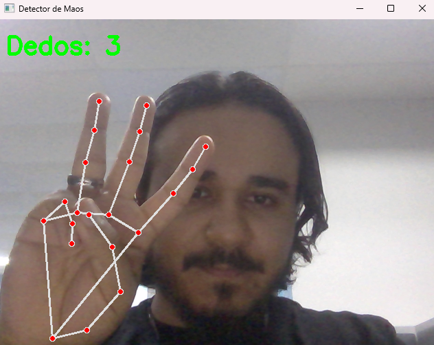
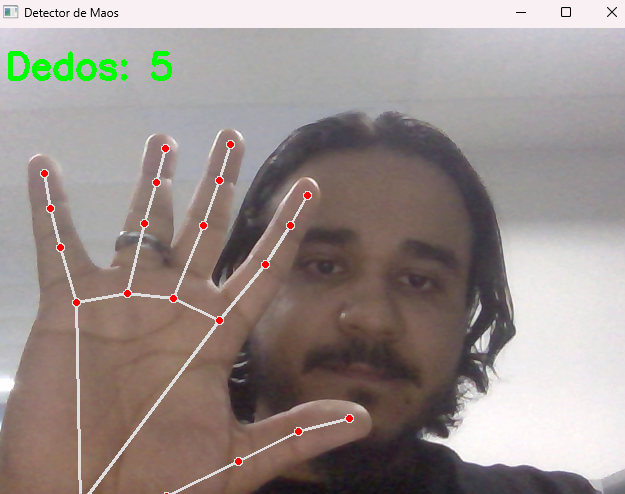

# 🖐️ Detector de Mãos com MediaPipe (Python)

Detector de mãos em tempo real usando **MediaPipe clássico** e **OpenCV**, com
contagem correta de dedos, incluindo correção do polegar por **ângulo + distância**.

## 📌 Versão
**v1.0.0**

---

## 🚀 Funcionalidades

- Detecção de mão em tempo real (webcam)
- Contagem correta dos dedos (0 a 5)
- Polegar tratado corretamente (não conta quando está dobrado)
- Independente de rotação da mão
- Compatível com Windows

---

## 🧰 Tecnologias

- Python 3.10
- MediaPipe (clássico)
- OpenCV

---

## ⚠️ Requisitos importantes

> ❗ MediaPipe **NÃO funciona corretamente com Python 3.11+ no Windows**

Use obrigatoriamente:

- **Python 3.10.x**

Download:
👉 https://www.python.org/downloads/release/python-31013/

---

## 📸 Demonstração

### 🖐️ Detecção e contagem de dedos


### ✋ Mão aberta (5 dedos)


### ✊ Mão fechada


---

## 📥 Instalação

### 1️⃣ Clone o repositório
```bash
git clone hhttps://github.com/TalysonRoberto/detector-maos-mediapipe.git
cd detector-maos-mediapipe

